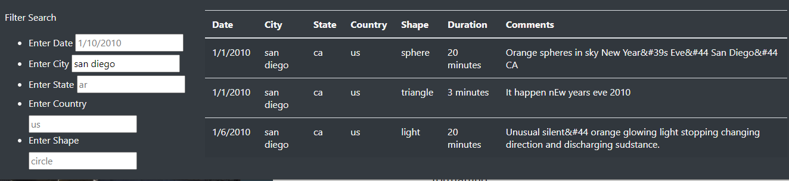
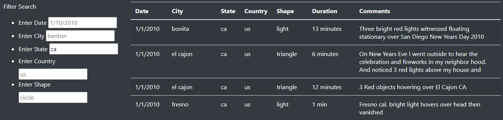

# UFOs

## Overview
The purpose of this project was to build a website that would allow users to filter and search a database on UFOs.

## Results

The webpage can filter based on search criteria put into the input boxes.  After the user enters their keyword in the in an input box the table will update once another action is preformed, eg clicking away or pressing enter. 

### Filtering based on city:

### Filtering based on state:

## Summary

### Drawback:
This design will update after each filter is applied.  This is fine for small databases such as this one. But if the database is large this method will make the proccess of entering in filters much longer as the whole database is filtered each time rather than all at once at the end.

### Reccomendations:
- Add error messages to the input boxes to let the user know if they entered something in the wrong format.
- Add another input box to search by sighting duration.

